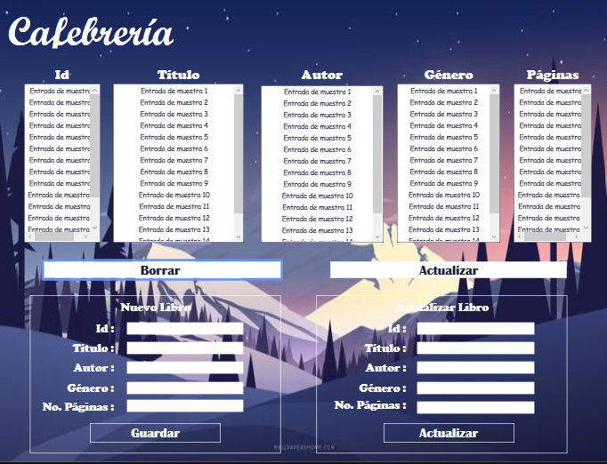

# CRUD_Cafebreria
Este proyecto fue creado como entregable final del segundo semestre en la materia de Programación Orientada a Entornos Virtuales, la práctica es un CRUD sobre una cafebrería (Librería - Café) conectada a una base de datos SQL Server, que permite agregar, eliminar y actualizar usuarios para el juego de Tic Tac Toe, que también se encuentra implementado en este mismo proyecto.

### Capturas de pantalla:

CRUD Cafebrería:

